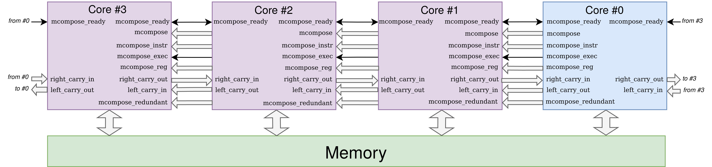

# HYDRA
HYDRA: multi-core RISC-V with cryptographically interesting modes of operation

Multi-core processor designs often represent an efficient, flexible solution for general-purpose workloads.
Based on the premise that multi-core processors are generally viable as an implementation platform for cryptography, 
this work investigates specific instances dubbed HYDRA which harness the concept of Composable Lightweight Processors to support
three cryptographically useful composition modes, namely, Redundant, Simd, and Widen data-path.
So, HYDRA can also operate in the modes specifically designed to address domain-specific challenges relating to efficiency and security while retaining characteristics which stem from a generic multi-core design. The Architecture Diagram of HYDRA is illustrated below:



The Repo. contains the source code of a framework to implement the HYDRA system and evaluate its supporting modes. We presented this work in [1].

## Organisation

```
├── bin                - scripts (e.g., environment configuration)
├── board              - the flows to implement the SoC system on specific supported boards: sakura-x, arty, iceFUN
├── build              - working directory for build
├── docs               - consists of figures and other documents
├── rtl                - Verilog rtl code of HYDRA SoC system
└── src                - ASM/C code of software to test and evaluate the HYDRA system
    ├── hal                - source code for SoC hardware abstract layer
    ├── redundant          - source code for AES encryption run in the HYDRA redundant mode
    ├── simd               - source code for ChaCha20 encryption run in the HYDRA Simd mode
    └── wide_data          - source code for multi-precision algorithms run in the HYDRA widen data-path mode
```

<!--- -------------------------------------------------------------------- --->

## Quickstart

- For seting up the repository

  - Clone the repository and setup environment 
  
    ```sh
    git clone https://github.com/scarv/hydra ./hydra
    cd ./hydra
    source bin/conf.sh
    ```

  - Fix paths for the RV32IM RISCV toolchains, Iverilog root and Vivado Tool, e.g.,
  
    ```sh
    export RISCV=/opt/riscv
    export PATH=/opt/iverilog/build/bin:$PATH
    export VIVADO_TOOL_DIR=/opt/Xilinx/Vivado/2018.2
    source $VIVADO_TOOL_DIR/settings64.sh
    ```

- Run a software, e.g., multi-precision algorithms (in the wide_data mode), or ChaCha20 (in the SIMD mode) on HYDRA to evaluate the performance on a FPGA platform:

  - Compile a test case
  ```sh
  TESTCASE=[wide_data|simd] make software
  ```
 
  - Build the system on FPGA using Sakura-x, and generate bitstream including the testcase compiled binary

  ```sh
  make sakura-x
  ```

  - Program the bitstream on Sakura-x

  ```sh
  make program-sakura-x
  ```

  - Open another terminal to observe the result

  ```sh
  microcom -p /dev/ttyUSB0 -s 9600
  ```

- For software development and debug avoiding FPGA re-implementation process, compile and update software for FPGA as belows:

  ```sh
  TESTCASE=[wide_data|simd] make -B software
  make bit-update
  make update-program
  ```

- Evaluate the fault detection in the redundant mode of HYDRA using the iverilog simulation.

  - Compile and run unprotected AES encryption under the PC-fault injection attack
  ```sh
  TESTCASE=redundant ACT="-DPC_FAULT_INJ" make -B simulate
  ```

  Or compile and run unprotected AES encryption under the data-fault injection attack 
  ```sh
  TESTCASE=redundant ACT="-DREG_FAULT_INJ" make -B simulate
  ```

  - Compile and run protected AES encryption on the HYDRA, configured with the redundant mode, under the PC- or data-fault injection attacks 
  ```sh
  TESTCASE=redundant MODE=PROTECTED ACT="-D[PC_FAULT_INJ|REG_FAULT_INJ]" make -B simulate
  ```

## Evaluation Results

- Cycle and instruction counts compared across a single core and the HYDRA composed wide data-path mode configured with 2 cores and 4 cores. The multi-precision algorithms with 1024-bit operands are used.

  | 1024-bit Operations   | Metric      | Single Core      |  2-core composed System    |  4-core composed System
  |  :-- | :-- | --: | --: | --: 
  |   Addition        | Instructions   </br>  Cycles |      431 </br>      2023 |      228 </br>      1225 |     124 </br>      843 |
  |   Multiplication  | Instructions   </br>  Cycles |    15822 </br>    179395 |     4083 </br>     72490 |    1091 </br>     32086|
  |   ModExp          | Instructions   </br>  Cycles | 57395054 </br> 594838395 | 15019653 </br> 238293765 | 4144180 </br> 106391562|

- Comparison of ChaCha20 encryption performance in Single Core, 128-bit vector System and the HYDRA composed SIMD mode configured with 2 cores and 4 cores for different message sizes

  |  Message size  | Metric      | Single Core      |  2-core composed System    |  4-core composed System | 128-bit Vector
  |  --: | :-- | --: | --: | --: | --:
  |   64 bytes      | Instructions   </br>  Cycles |      1765  </br>  17603 |   1199 </br>   11905 |   659 </br>   7609 |  607 </br> - |
  |  256 bytes      | Instructions   </br>  Cycles |      6919  </br>  69524 |   4637 </br>   46435 |  2537 </br>  29659 | 2332 </br> - |
  | 1024 bytes      | Instructions   </br>  Cycles |     27535  </br> 277208 |  18389 </br>  184555 | 10049 </br> 117859 | 9232 </br> - |

- Results of unprotected and protected AES encryption against control flow and data fault injections. The protected AES encryption is executed in the HYDRA composed redundant mode to detect a fault happened in one composed core. The results reports 100 fault cases where a fault is injected into the program counter (resp. a general purpose register) in a Control flow fault case (resp. Data fault case)

  - Control flow fault case

  | Implementations | Passed | Failed | Broken | Detected 
  |  --: | :--: | :--: | :--: | :--:
  | Unprotected AES | 30     | 62     | 8      | -- 
  | Protected AES   | 12     |  0     | 2      | 87 

  - Data fault case 

  | Implementations | Passed | Failed | Broken | Detected 
  |  --: | :--: | :--: | :--: | :--: 
  | Unprotected AES | 42     | 29     | 29     | --
  | Protected AES   | 46     | 0      | 0      | 54

## References

[1] <a href=https://carrv.github.io/2022/papers/CARRV2022_paper_7_Marshall.pdf>
Ben Marshall, Dan Page, Thinh Pham, Max Whale, HYDRA: multi-core RISC-V with cryptographically interesting modes of operation, Sixth Workshop on Computer Architecture Research with RISC-V (CARRV 2022).
    </a>

## Acknowledgements

This work has been supported in part
by EPSRC via grant
[EP/R012288/1](https://gow.epsrc.ukri.org/NGBOViewGrant.aspx?GrantRef=EP/R012288/1) (under the [RISE](http://www.ukrise.org) programme).
